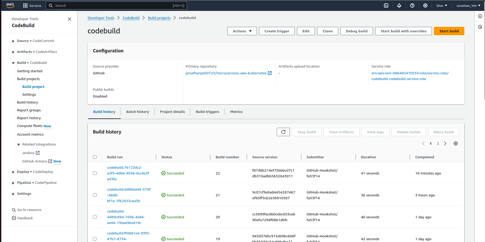
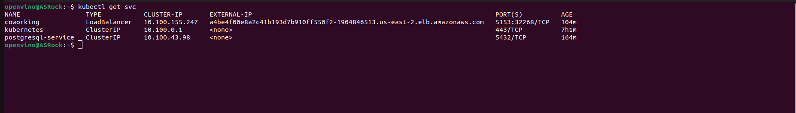
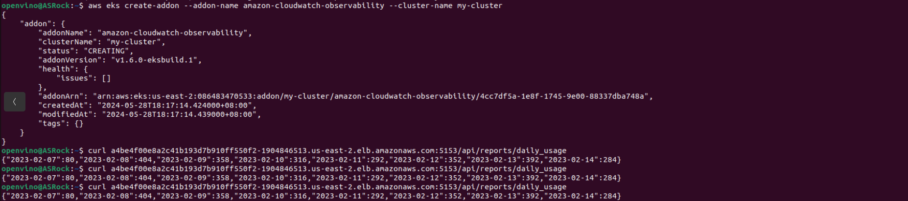

# Coworking Space Service Extension
The Coworking Space Service is a set of APIs that enables users to request one-time tokens and administrators to authorize access to a coworking space. This service follows a microservice pattern and the APIs are split into distinct services that can be deployed and managed independently of one another.

For this project, you are a DevOps engineer who will be collaborating with a team that is building an API for business analysts. The API provides business analysts basic analytics data on user activity in the service. The application they provide you functions as expected locally and you are expected to help build a pipeline to deploy it in Kubernetes.

## Getting Started

### Dependencies
#### Local Environment
1. Python Environment - run Python 3.6+ applications and install Python dependencies via `pip`
2. Docker CLI - build and run Docker images locally
3. `kubectl` - run commands against a Kubernetes cluster
4. `helm` - apply Helm Charts to a Kubernetes cluster

#### Remote Resources
1. AWS CodeBuild - build Docker images remotely
2. AWS ECR - host Docker images
3. Kubernetes Environment with AWS EKS - run applications in k8s
4. AWS CloudWatch - monitor activity and logs in EKS
5. GitHub - pull and clone code

### Setup
### 1. Configure a Database

See the following.

### 2. Running the Analytics Application Locally
In the `analytics/` directory:

1. Install dependencies
```bash
pip install -r requirements.txt
```
2. Run the application (see below regarding environment variables)
```bash
<ENV_VARS> python app.py
```

There are multiple ways to set environment variables in a command. They can be set per session by running `export KEY=VAL` in the command line or they can be prepended into your command.

* `DB_USERNAME`
* `DB_PASSWORD`
* `DB_HOST` (defaults to `127.0.0.1`)
* `DB_PORT` (defaults to `5432`)
* `DB_NAME` (defaults to `postgres`)

If we set the environment variables by prepending them, it would look like the following:
```bash
DB_USERNAME=username_here DB_PASSWORD=password_here python app.py
```
The benefit here is that it's explicitly set. However, note that the `DB_PASSWORD` value is now recorded in the session's history in plaintext. There are several ways to work around this including setting environment variables in a file and sourcing them in a terminal session.

3. Verifying The Application
* Generate report for check-ins grouped by dates
`curl <BASE_URL>/api/reports/daily_usage`

* Generate report for check-ins grouped by users
`curl <BASE_URL>/api/reports/user_visits`

## Project Instructions
1. Set up a Postgres database with a Helm Chart
2. Create a `Dockerfile` for the Python application. Use a base image that is Python-based.
3. Write a simple build pipeline with AWS CodeBuild to build and push a Docker image into AWS ECR
4. Create a service and deployment using Kubernetes configuration files to deploy the application
5. Check AWS CloudWatch for application logs

### Deliverables
1. `Dockerfile`

 

2. Screenshot of AWS CodeBuild pipeline



3. Screenshot of AWS ECR repository for the application's repository


4. Screenshot of `kubectl get svc`



5. Screenshot of `kubectl get pods`


6. Screenshot of `kubectl describe svc <DATABASE_SERVICE_NAME>`


7. Screenshot of `kubectl describe deployment <SERVICE_NAME>`


8. All Kubernetes config files used for deployment (ie YAML files)

Refer to the foler `deployment` and `DB-YAML`.
```
deployment
├── configmap.yaml
├── coworking.yaml
└── secret.yaml

0 directories, 3 files
```

```
├── postgresql-deployment.yaml
├── postgresql-service.yaml
├── pvc.yaml
└── pv.yaml

0 directories, 4 files
```

9. Screenshot of AWS CloudWatch logs for the application




Basically, follow the below instructions for setup:

 - Create AWS EKS Cluster on the web interface

 - Install AWS CLI
```
curl "https://awscli.amazonaws.com/awscli-exe-linux-x86_64.zip" -o "awscliv2.zip"
unzip awscliv2.zip
sudo ./aws/install

aws configure
```
 - Install `kubectl`
```
curl -LO https://dl.k8s.io/release/v1.30.0/bin/linux/amd64/kubectl
sudo install -o root -g root -m 0755 kubectl /usr/local/bin/kubectl
chmod +x kubectl

mkdir -p ~/.local/bin
mv ./kubectl ~/.local/bin/kubectl
```

 - Using AWS CLI to create an EKS Cluster
```
eksctl create cluster --name my-cluster --region us-east-2 --nodes=2 --version=1.29 --instance-types=t3.micro
```
 - Create Postgresql database
```
kubectl apply -f db/
```

 - Port forwarding. Run seed files.
```
kubectl port-forward svc/postgresql-service 5433:5432 &

export DB_PASSWORD=mypassword
PGPASSWORD="$DB_PASSWORD" psql --host 127.0.0.1 -U myuser -d mydatabase -p 5433 < db/1_create_tables.sql
PGPASSWORD="$DB_PASSWORD" psql --host 127.0.0.1 -U myuser -d mydatabase -p 5433 < db/2_seed_users.sql
PGPASSWORD="$DB_PASSWORD" psql --host 127.0.0.1 -U myuser -d mydatabase -p 5433 < db/3_seed_tokens.sql
```

 - Deploy the service by
```
kubectl apply -f deployment/
```

The `deployment` includes 3 files:
```
deployment
├── configmap.yaml
├── coworking.yaml
└── secret.yaml

0 directories, 3 files
```

 - Check
```
kubectl get svc
kubectl get pods
kubectl describe svc <DATABASE_SERVICE_NAME>
kubectl describe deployment <SERVICE_NAME>
```

### Best Practices
* Dockerfile uses an appropriate base image for the application being deployed. Complex commands in the Dockerfile include a comment describing what it is doing.
* The Docker images use semantic versioning with three numbers separated by dots, e.g. `1.2.1` and  versioning is visible in the  screenshot. See [Semantic Versioning](https://semver.org/) for more details.
